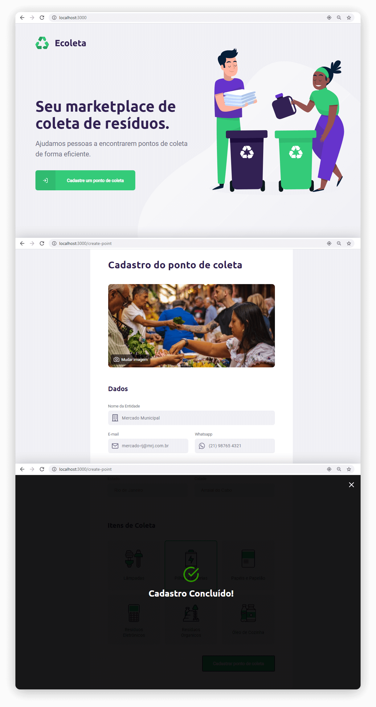
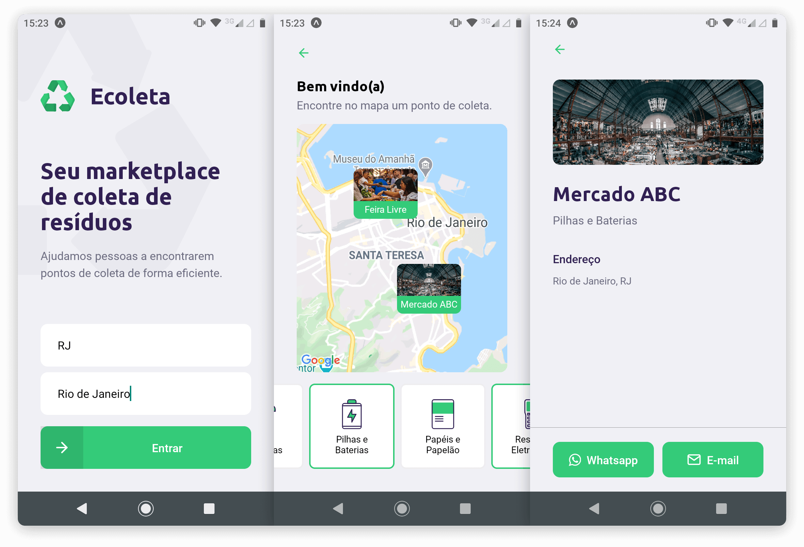

<h1 align="center">
    
</h1>

## Ecoleta
Ecoleta é um aplicativo que uxilia na coleta de resíduos orgaânicos e inorgânicos. O aplicativo pode ser acessado pelo App para smartphone e também pelo site.
 
O Ecoleta é um projeto experimental, desenvolvido para participação no evento <strong>Next Level Week #01</strong>, promovido pela <strong>Rocketseat</strong>.

## Web
<h1 align="center">
    
</h1>

## Mobile
<h1 align="center">
    
</h1>

## Tecnologias utilizadas no Projeto

- Node
- React
- React Native
- TypeScript
- Express
- Knex
- Axios
- Expo
